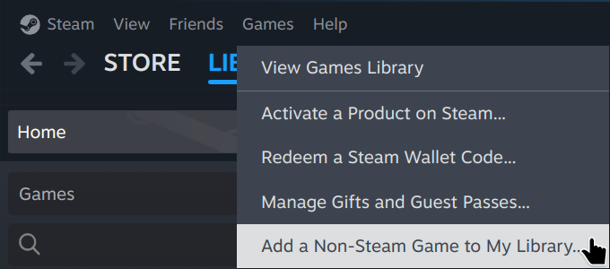

# **steam-windows-emulation**

Tutorial on how to use Steam for Linux as a Windows emulator.

## Overview

Steam is a digital content distribution service developed by Valve.
As most games are developed for the Windows platform, Valve created
an open-source tool called Proton for the Steam Linux client.
Proton acts as Windows compatibility layer for Linux, allowing games
exclusive to Windows to run on Linux.

While Proton was developed for allowing Windows games to run on Linux,
it can also be used to run *any* type of Windows software, from games
to productivity applications.
This allows Steam for Linux to serve as a Windows emulator that is
easy to setup and configure.

This tutorial will demonstrate this capability by using Steam for Linux
to install and configure Notepad++, a popular Windows text editor.

## Prerequisites

Before we begin, you will need to have:

* The Steam for Linux client installed
* The Windows `.exe` installer for your application

In this tutorial, I will be using the Notepad++ installer
`npp.8.8.1.Installer.x64.exe`.

## Level One: Installation

### Installing the Program

In the Steam client, select `Games > Add a Non-Steam Game to My Library`
from the menu:

<p></p>

The window `Add Non-Steam Game` will pop up. Select the `Browse…` button:

<p></p>

Navigate to the location of your Windows `.exe` installer and select it.
You can filter the list in the `Add Non-Steam Game` window by entering
the name of the installer in the text field. Once you have ensured your
installer is checked, click the `Add Selected Programs` button:

<p></p>

This will add the installer to your Games list on the left side of your
Library. Before you launch the installer, right-click it and select
`Properties…`:

<p></p>

A properties window will pop up.
Click on the `Compatibility` section on the left side.
Check the `Force the use of a specific Steam Play compatibility tool`
option and select from the drop-down the latest stable version of Proton.
At the time of this writing that version is `Proton 9.0-4`:

<p></p>

When you are done, close the window and launch the program.
The installer for your selected application should appear:

<p></p>

If for some reason the installer does not launch, try selecting a different
version of Proton. Once the installation process is complete, you should see
your program successfully launch:

<p></p>

Although the program launched, the shortcut is still configured to launch
the installer. Next, we will need to modify the shortcut properties so that
it launches the installed program instead of the installer.

## Level Two: Configuration

### Locate the installed application

First you will need to locate where the application was installed.
When you add an application to Steam, the files for that application
are placed in a subdirectory located at:

```
~/.local/share/Steam/steamapps/compatdata/
```

However, these subdirectories are named with numerical IDs rather than the
application name. You will need to identify which subdirectory contains the
application you just installed. The easiest method will be to use the `find`
command from the terminal. To do this, first navigate to the parent directory:

```
cd ~/.local/share/Steam/steamapps/compatdata/
```

Then use the `find` command with the name of your application:

```
find . -iname '*notepad++*'
```

If this does not reveal the location, you will need to manually search for the
directory. Since we just installed the application, you can narrow down your
search by checking the creation timestamps of the subdirectories by running:

```
ls -l --time=creation
```

As an example, my Notepad++ installation was placed in a directory named
`3060847736` and I found the `.exe` for the application at:

```
~/.local/share/Steam/steamapps/compatdata/3060847736/pfx/drive_c/Program Files/Notepad++/notepad++.exe
```

Once you have found the correct location of the `.exe` for the application,
continue to the next step.

### Modify the shortcut properties

Close out the application if you have not done so already.
As before, right-click the entry for your application in the Games list
on the left side of your Library and select `Properties…`:

<p></p>

We will need to point the Steam shortcut to the actual location of the
installed Windows program.
This is done by modifying the `TARGET` and `START IN` shortcut properties.
Before you enter these properties, note that:

* You cannot use tilde expansion `~/` to reference your home directory.
Use the full path instead.
* Both values need to be enclosed in quotation marks.
* The below two examples are specific to my installation.
Use the paths for your installation from the previous step.

In the `TARGET` field, enter the full path to the `.exe`:

```
"/home/user/.local/share/Steam/steamapps/compatdata/3060847736/pfx/drive_c/Program Files/Notepad++/notepad++.exe"
```

In the `START IN` field, enter the directory containing the `.exe`:

```
"/home/user/.local/share/Steam/steamapps/compatdata/3060847736/pfx/drive_c/Program Files/Notepad++"
```

You can also modify the name of the shortcut at the top to reflect the
application name. When you are done, your `Shortcut` section should look
similar to the following:

<p></p>

### Launch the application

Close out the properties window and launch the application.
If you configured everything correctly, the application should run:

<p></p>

And you are done! However, if you are like me and find yourself squinting
to read the text in the application, you may want to continue to the
next step.

## Level Three: DPI Scaling

First, close out the application.
To change the DPI scaling settings for the application, you will need to
modify the `user.reg` file for the application. This file can be found in
the `pfx` subdirectory of your installation. For example:

```
~/.local/share/Steam/steamapps/compatdata/3060847736/pfx/user.reg
```

Open this file in a text editor of your choice, then search for a section
heading named `[Control Panel\\Desktop]`:

<p></p>

Below this heading will be a list of values. To change the DPI scaling for
this application, you will need to add two values to the end of this section.

* The first value is `"Win8DpiScaling"=dword:00000001`
which enables DPI scaling.

* The second value is `LogPixels` which specifies the DPI scaling value.
Since this value is expressed as a hexadecimal number, refer to the following
table to determine which value to use based on your desired DPI setting:

    | Scaling | DPI | Value |
    | ---- | ----: | ---- |
    | 100% | 96 | `"LogPixels"=dword:00000060` |
    | 125% | 120 | `"LogPixels"=dword:00000078` |
    | 150% | 144 | `"LogPixels"=dword:00000090` |
    | 200% | 192 | `"LogPixels"=dword:000000c0` |

For example, to set my DPI scaling to 200% I would add the following two
lines as highlighted below:

<p></p>

Save `user.reg` and relaunch the application. The new DPI scaling
will now be in effect:

<p></p>

## License

GNU General Public License v3.0

## References

[Steam Homepage](https://store.steampowered.com/)

[Notepad++ Homepage](https://notepad-plus-plus.org/)

[GitHub - ValveSoftware/steam-for-linux](https://github.com/ValveSoftware/steam-for-linux)

[GitHub - ValveSoftware/Proton](https://github.com/ValveSoftware/Proton)
